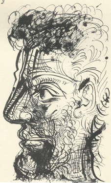

# ImageQuilting

This repo provides a Pytorch implementation of the Efros and Freeman Image Quilting algorithm, as introduced in 2001. From a high level, this creates new images by stitching together small patches from a source texture in a way that preserves the visual coherence at patch boundaries.  

## Instalation
1) `git clone https://github.com/HarrisonSantiago/ImageQuilting.git`
2) `pip install torch`

## Texture Synthesis Usage

Texture synthesis is simple, just name the original texture and the desired image size. Below we show examples of the original texture, generated texture, and the command used. 

| Original | Transformed | Command |
|----------|-------------|---------|
|  |  | `python.exe .\main.py --synthesis --output_path .\results\synthesis\animal_hair_b_25_o_10_s_1p5.png -i1 .\images\animal_hair.png --block_size 50 --overlap 10 --scale 1.5` |
|  |  | `python main.py --synthesis --output_path .\results\synthesis\circles_b_25_o_5_s_1p5.png -i1 .\images\circles.png -b 35 -o 5 -s 1.5` | 
|  |  | `python main.py --synthesis --output_path .\results\synthesis\wallpaper_b_50_o_10_s_1p5.png -i1 .\images\wallpaper.jpeg -b 50 -o 10 -s 1.5` | 

## Texture transfer usage

Texture transfer is similarly simple. Name the original texture and the target image. Examples are shown below

| Texture | Target | Transformed | Command |
|----------|-------------|-------------|---------|
|  |  |  | `python main.py --transfer --output_path .\results\transfer\lincoln_starry_night.png -i1 .\images\starry_night.jpg -i2 .\images\lincoln.jpg -b 15 -n 4` |
|  |  |  | `python main.py --transfer --output_path .\results\transfer\lincoln_starry_night.png -i1 .\images\rope.png -i2 .\images\fence.png -b 15 -n 5 ` |
|  |  |  | `python main.py --transfer --output_path .\results\transfer\drawing_paint.png -i1 .\images\paint.jpg -i2 .\images\drawing.png -b 15 -n 5   ` |